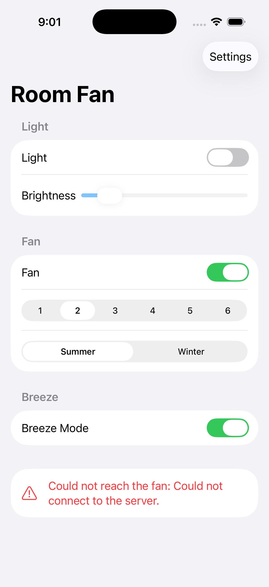

# Room Fan

A minimal iPhone app that replaces the Bluetooth remote for a
[Modern Forms][prod] ceiling fan — light, brightness, fan power, six speeds,
direction and Breeze Mode.

It talks to the fan over **Wi-Fi**, not Bluetooth. That is not a preference:
sniffing the physical remote proved it broadcasts its commands rather than
connecting, and iOS gives an app no way to transmit a raw BLE advertisement, so
no iPhone app can impersonate this remote. The frame is decoded — and every
claimed workaround checked against Apple's own documentation — in
[docs/ble-capture-2026-08-22.md](docs/ble-capture-2026-08-22.md). The Wi-Fi
command reference is in [PROTOCOL.md](PROTOCOL.md).



## What's here

| | |
| --- | --- |
| [`Sources/ModernFormsKit`](Sources/ModernFormsKit) | The protocol: state model, commands, HTTP client, subnet discovery |
| [`Sources/mfctl`](Sources/mfctl) | A CLI to poke the fan from a Mac |
| [`Sources/blescan`](Sources/blescan) | A Mac Bluetooth probe, for working out what the remote and receiver broadcast |
| [`App/RoomFan`](App/RoomFan) | The SwiftUI app, plus a Bluetooth Explorer for further digging |
| [`PROTOCOL.md`](PROTOCOL.md) | The reverse-engineering write-up and API reference |

## First: does your fan have Wi-Fi?

Not all Modern Forms receivers do, and the Bluetooth remote works without it.
Check in this order — details in
[PROTOCOL.md](PROTOCOL.md#does-your-fan-have-wi-fi):

1. **`swift run mfctl scan`** — if it finds the fan, you are done.
2. **Look at your phone's Wi-Fi list for `ModernFormsFan_XXXXXX`.** That means
   the fan has Wi-Fi but was never set up. Join it (password `intelligence`)
   and the fan answers on `10.10.10.1`.
3. **Neither?** If you moved into the house, the fan may still be looking for
   the previous owner's network. Section 5 of the [instruction sheet][inst]
   resets that: hold the two buttons it pictures for 10 seconds (they are drawn
   rather than named, so check the sheet). This resets Wi-Fi settings only,
   keeps your remote paired, and makes the fan broadcast
   `ModernFormsFan_XXXXXX`. Then retry step 2.
4. **Still nothing?** You likely have a Bluetooth-only receiver, and this app
   cannot reach it. Run the Bluetooth probe below and see
   [The Bluetooth question](PROTOCOL.md#the-bluetooth-question).

## Try it against your fan

Find the fan and drive it from the command line first — quicker than
installing anything:

```bash
swift run mfctl scan
```

```bash
swift run mfctl 192.168.1.50 speed 3
```

`scan`, `status`, `fan on|off`, `speed 1-6`, `forward|reverse`,
`light on|off`, `brightness 1-100`, `breeze on|off`. An address may carry a
port (`192.168.1.50:8088`).

Or with no Swift at all:

```bash
curl -X POST http://192.168.1.50/mf -H 'Content-Type: application/json' -d '{"fanOn":true,"fanSpeed":4,"queryDynamicShadowData":true}'
```

## Probe the Bluetooth side

macOS kills a command-line tool that touches Bluetooth without an embedded
usage description, so build this one through the script, and run it from
**Terminal.app** — the permission prompt cannot appear otherwise.

```bash
./Tools/build-blescan.sh && ./.build/release/blescan 20
```

Press buttons on the remote while it scans. A device marked `broadcast-only`
whose manufacturer-data payload changes on each press is the remote, and an
iPhone cannot reproduce that. Follow one device and see exactly which bytes
move when you press a single button:

```bash
./.build/release/blescan watch <device-uuid> 60
```

A `connectable` device is worth dumping instead:

```bash
./.build/release/blescan dump <device-uuid>
```

The remote's frame format, decoded, is in
[docs/ble-capture-2026-08-22.md](docs/ble-capture-2026-08-22.md).

## Build the app

Needs [XcodeGen](https://github.com/yonaskolb/XcodeGen) (`brew install xcodegen`)
— the `.xcodeproj` is generated, not committed.

```bash
cd App && xcodegen generate && open RoomFan.xcodeproj
```

On first launch, tap **Choose a fan** → **Scan this network**, or type the
address in. It is stored and the app reconnects on its own.

## How this was worked out

The fan came with a [Bluetooth remote][prod], so Bluetooth looked like the
obvious target. It was the wrong one, and finding that out cheaply was most of
the work.

**1. Look for prior art.** Nobody has published anything on the Modern Forms
BLE link — not on GitHub, the Home Assistant forums, or in FCC filings. The
Wi-Fi side, by contrast, is thoroughly documented: there is a [Home Assistant
integration][ha], a [Python client][aio], and a [write-up of the provisioning
protocol][cb].

**2. Read the remote's own manual.** The [F-RCBT-WT instruction sheet][inst]
has a section titled *"Fan Wi-Fi Reset"*, and its factory-reset warning
mentions removing "Modern Forms app connections". So the Bluetooth receiver in
the fan is the same board that joins your Wi-Fi — the remote is just one of
several controllers paired to it. Every function the remote has maps one-to-one
onto a Wi-Fi API key.

**3. Check whether an iPhone could speak Bluetooth anyway.** It probably
cannot. iOS will not let an app transmit arbitrary BLE advertisements, and
ceiling fan remotes are typically broadcast-only devices — which is why
[`ha-ble-adv`][bleadv] needs an ESP32 rather than a phone. Chasing it would
have meant a hardware sniffer for capability the Wi-Fi API already provides.

**4. Build on Wi-Fi, and ship the Bluetooth instruments anyway.** Those
instruments then settled it: the remote is broadcast-only, sending a 10-byte
frame carrying a button code and a per-press rolling counter. Decoded in
[docs/ble-capture-2026-08-22.md](docs/ble-capture-2026-08-22.md). So step 3 was
right for a firmer reason than it started with.

## What's verified, and what isn't

Verified: the protocol implementation is exercised end to end against the
`mock_fan` emulator that ships with [`aiomodernforms`][aio] — every command
from both the CLI and the app's UI, plus the state the app renders. 13 unit
tests cover command encoding, clamping, state decoding and address parsing.

```bash
swift test
```

To run the emulator yourself:

```bash
git clone https://github.com/wonderslug/aiomodernforms && cd aiomodernforms && pip install aiohttp backoff && python -m mock_fan --generation gen3 --breeze --port 8088
```

**Not verified against real hardware.** One attempt has been made. On the
author's network a full sweep of the /24 found no fan: eight live hosts, two of
them embedded web servers that 404 on `/mf` and turned out by MAC prefix to be
Meross devices. The fan itself never appeared — consistent with a receiver
whose Wi-Fi was never provisioned, since the house had no Wi-Fi when the fan
was inherited. A Bluetooth scan from the same Mac was not possible either:
macOS refuses Bluetooth to a process that cannot show a permission prompt.

So two things remain assumptions:

- That setting `fanSpeed` should also send `fanOn: true` (and likewise for
  brightness), matching what the remote does on a stopped fan.
- That your receiver is on Wi-Fi at all. If your fan predates 2021, is an RF
  model, or has a Bluetooth-only receiver, none of this applies. Work through
  [does your fan have Wi-Fi?](#first-does-your-fan-have-wi-fi) first.

Both tools that read Bluetooth — `blescan` and the app's Bluetooth Explorer —
are diagnostics only. They read; they do not control.

## References

- [Modern Forms Bluetooth Remote Control (F-RCBT-WT)][prod] · [instruction sheet (PDF)][inst]
- [colinbourassa — Modern Forms fan IP control][cb]
- [`aiomodernforms`][aio] · [Home Assistant integration][ha] · [community thread][thread]
- [`ha-ble-adv`][bleadv] — broadcast-style BLE fan remotes

[prod]: https://modernforms.com/product/bluetooth-remote-control/
[inst]: https://modernforms.com/images/products/INST_SHEET/F-RCBT_INSSHT.pdf
[cb]: https://colinbourassa.github.io/software/modernforms/
[aio]: https://github.com/wonderslug/aiomodernforms
[ha]: https://www.home-assistant.io/integrations/modern_forms/
[thread]: https://community.home-assistant.io/t/modern-forms-smart-fans-integration/109318
[bleadv]: https://github.com/NicoIIT/ha-ble-adv
